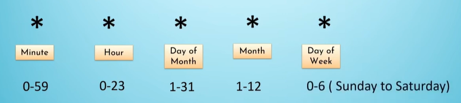
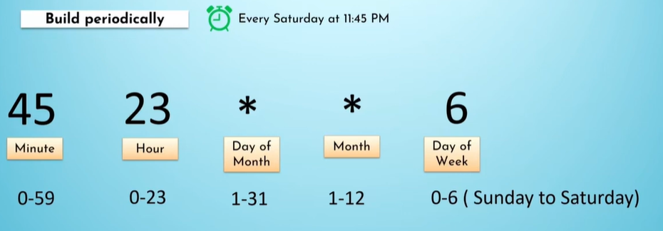
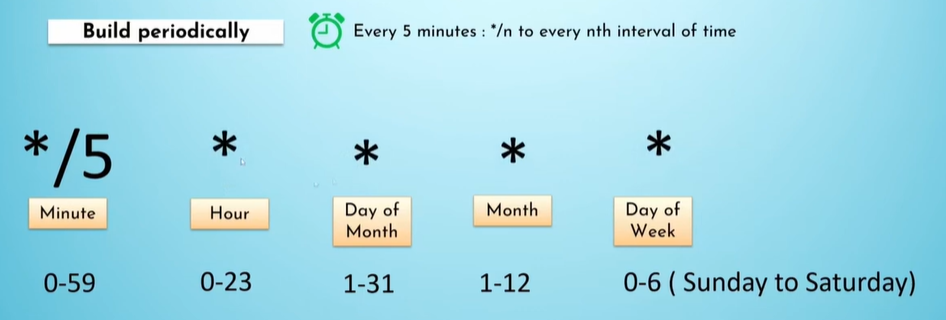

# DaemonSet, CronJob, and Job

## 🟦 DaemonSet

A **DaemonSet** ensures that **one pod runs on every node** in your Kubernetes cluster.

### 🔹 Key Characteristics

- Automatically creates **one pod per node**.
- When a **new node joins**, the DaemonSet automatically schedules a pod on it.
- When a node is removed, the associated DaemonSet pod is removed automatically.

### 🔹 Common Use Cases

- Logging agents (e.g., Fluentd, Logstash)
- Monitoring agents (e.g., Prometheus Node Exporter)
- Networking components (e.g., CNI plugins)
- Control-plane related components (in some architectures)

### 🔹 Commands

```sh
kubectl get ds
```

---

## 🟩 CronJob

A **CronJob** is a Kubernetes object used to schedule jobs at specific times—similar to Linux cron.

### 🔹 Cron Syntax (Fields)

```
# ┌───────────── minute (0 - 59)
# │ ┌───────────── hour (0 - 23)
# │ │ ┌───────────── day of the month (1 - 31)
# │ │ │ ┌───────────── month (1 - 12)
# │ │ │ │ ┌───────────── day of the week (0 - 6) (Sunday to Saturday)
# │ │ │ │ │                                   OR sun, mon, tue, wed, thu, fri, sat
# │ │ │ │ │
# │ │ │ │ │
# * * * * *
```

### 📘 Cron Syntax Diagram



---

### 📌 Example 1

**Run every Saturday at 11:45 PM**



---

### 📌 Example 2

**Run every 5 minutes**



---

## 🟨 Job

A **Job** creates one or more pods and ensures that **a task runs to completion**.

### 🔹 Key Points

- Runs **one-time tasks**.
- Ensures completion even if a pod fails (retries it).
- Often used for backup scripts, DB migration tasks, data processing steps, etc.
