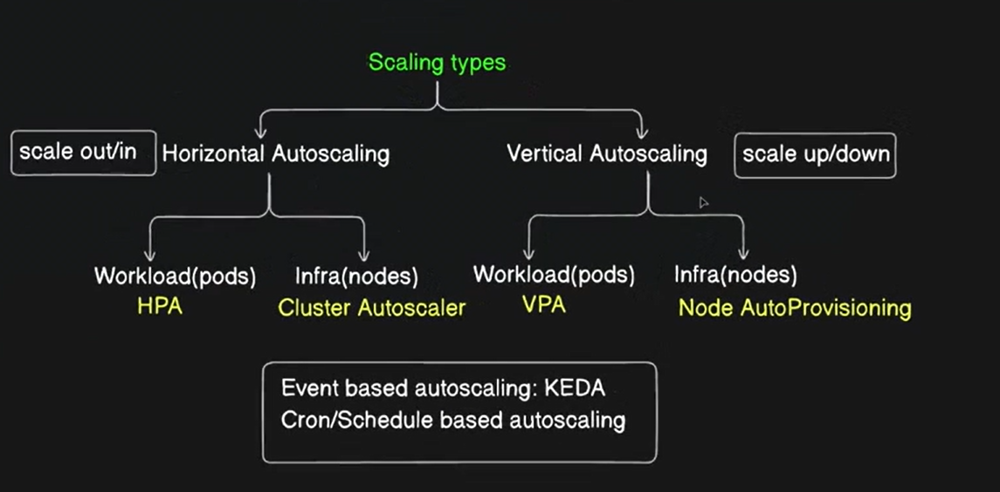

# 📘 **Autoscaling in Kubernetes**

Autoscaling allows Kubernetes to **automatically adjust resources** based on **application demand and resource usage**.

👉 Goal: **Maintain performance while optimizing resource usage**

---

## ✅ **Why Autoscaling?**

- Handle traffic spikes automatically
- Improve availability and performance
- Reduce manual intervention
- Optimize infrastructure cost

---

<br>

# 🔄 **Types of Autoscaling**

---

## **1️⃣ Horizontal Pod Autoscaler (HPA)**

### 📌 **What It Does**

- Automatically **increases or decreases the number of Pods**
- Based on metrics like:

  - CPU usage
  - Memory usage
  - Custom metrics (via Prometheus, etc.)

### 🧠 **Key Characteristics**

- Most commonly used autoscaling method
- Works at **Pod level**
- Requires **metrics-server**

---

### ⚙️ **Create HPA Using kubectl**

```bash
kubectl autoscale deploy <deployment-name> \
  --cpu-percent=<target-cpu-percentage> \
  --min=<min-replicas> \
  --max=<max-replicas>
```

---

### 📌 **Example**

```bash
kubectl autoscale deploy php-apache \
  --cpu-percent=50 \
  --min=1 \
  --max=10
```

Meaning:

- Maintain average CPU usage at **50%**
- Scale Pods between **1 and 10**

---

### 🔍 **Check HPA Status**

```bash
kubectl get hpa
```

---

<br>

## **2️⃣ Vertical Pod Autoscaler (VPA)**

### 📌 **What It Does**

- Automatically **adjusts CPU and memory requests/limits**
- Improves resource sizing for Pods

### ⚠️ **Important Limitation**

- Requires **Pod restart**
- Causes **downtime**
- Not suitable for latency-sensitive workloads

### 🧠 **Use Cases**

- Batch jobs
- Non-critical services
- Background workloads

---

<br>

# 🖼️ **Scaling Types (Conceptual View)**

- **Horizontal Scaling** → Add/remove Pods
- **Vertical Scaling** → Increase/decrease Pod resources



<br>

# 📊 **Load Testing HPA**

To test autoscaling, generate continuous load.

### 🚀 **Run Load Generator**

```bash
kubectl run -i --tty load-generator \
  --rm \
  --image=busybox:1.28 \
  --restart=Never \
  -- /bin/sh -c \
  "while sleep 0.01; do wget -q -O- http://php-apache; done"
```

✔️ This continuously sends traffic
✔️ CPU usage increases
✔️ HPA scales Pods automatically

---

<br>

# ⚙️ **HPA Requirements**

- metrics-server must be running
- Pods must have **CPU requests defined**
- Deployment / ReplicaSet must exist

---

<br>

# 📝 **Best Practices**

- Always define **resource requests**
- Use HPA for **stateless applications**
- Avoid VPA for production real-time apps
- Monitor scaling behavior regularly
- Combine HPA with **Cluster Autoscaler** for node-level scaling

---

<br>

# 📌 **Summary**

- Autoscaling adjusts resources automatically
- HPA → scales number of Pods
- VPA → scales Pod resources (needs restart)
- HPA is production-friendly
- VPA is resource-optimization focused

---

📚 **Official Documentation**
Kubernetes HPA Walkthrough:
[https://kubernetes.io/docs/tasks/run-application/horizontal-pod-autoscale-walkthrough/](https://kubernetes.io/docs/tasks/run-application/horizontal-pod-autoscale-walkthrough/)
